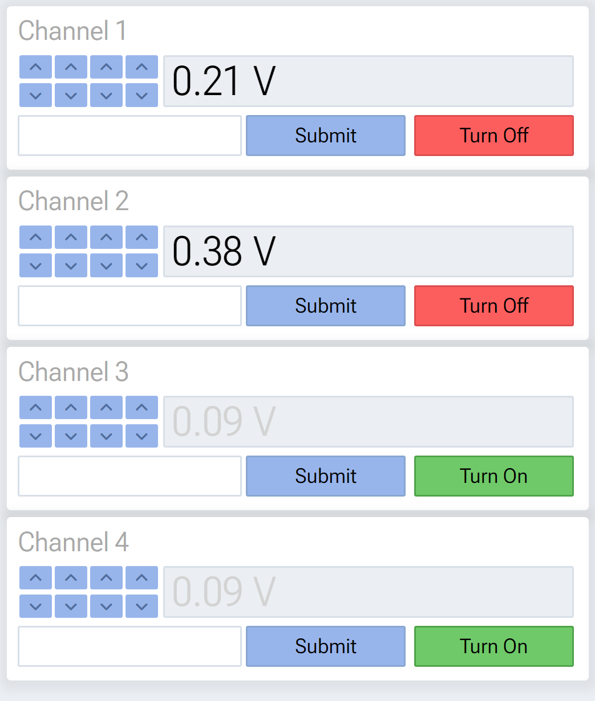

## Isolated Voltage Source Webserver and GUI

A webserver using FastAPI for interfacing with a UDP-controlled isolated voltage source. The frontend is written in vanilla html and javascript.

<!--  -->

<p align="center">
  
</p>

-- Andrew Mueller 2022

The webserver is packaged using docker. Docker commands to deloy or build the container:


### Build command:
```console
docker build -t vsource_controll .
```

run command:
### to make a new container from updated image:
```console
docker run -d --restart unless-stopped --name vsource_controll_container -p 80:80 vsource_controll 
```


### to run existing container
```console
docker run -d -p 80:80 vsource_controll -d --restart unless-stopped
```

